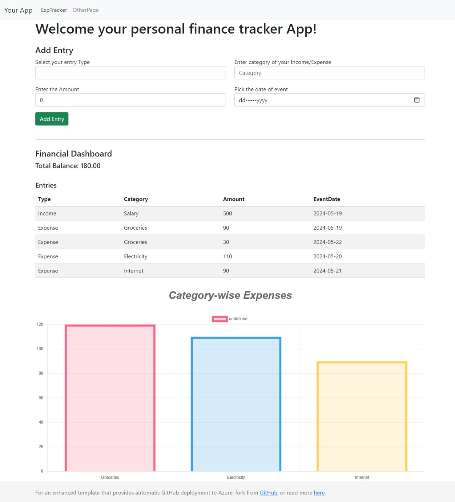
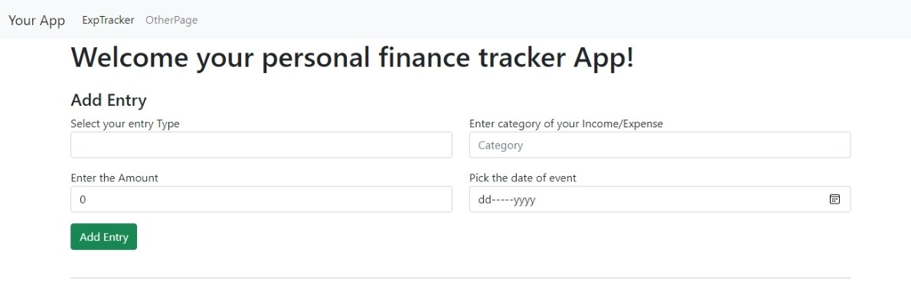
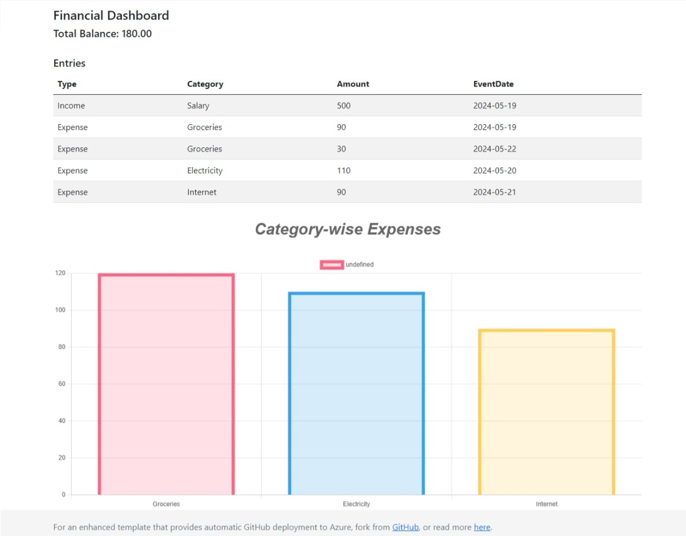

# Personal Finance Tracker App

Welcome to the Personal Finance Tracker App! This application is designed to help you manage your financial transactions effectively. With this app, you can add income and expense entries, view your total balance, and see a graphical representation of your expenses by category.

## Live Demo

Check out the live demo of the app [here](https://bhavik9085.github.io/assignment_2_fsharp/).

## Features

- **Add Income/Expense Entries:** Record your financial transactions by specifying the type, category, amount, and date.
- **View Total Balance:** See the current balance calculated from your income and expenses.
- **Expense Dashboard:** Visual representation of expenses categorized for better insights.

## Technologies Used

- **F#**: Main programming language for the backend.
- **WebSharper**: F# framework for web development.
- **HTML/CSS**: For structuring and styling the web pages.
- **JavaScript**: For client-side interactivity.
- **Bootstrap**: For responsive and sleek UI design.
- **Chart.js**: For graphical representation of data.

## Screenshots

### Home Page

### Add Entry Form

### Financial Dashboard

